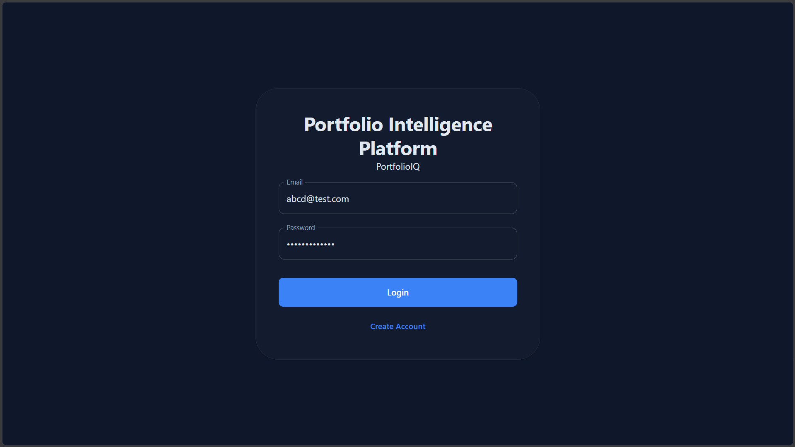
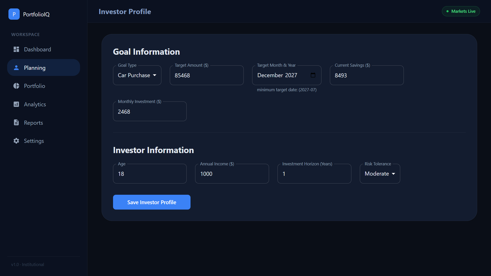
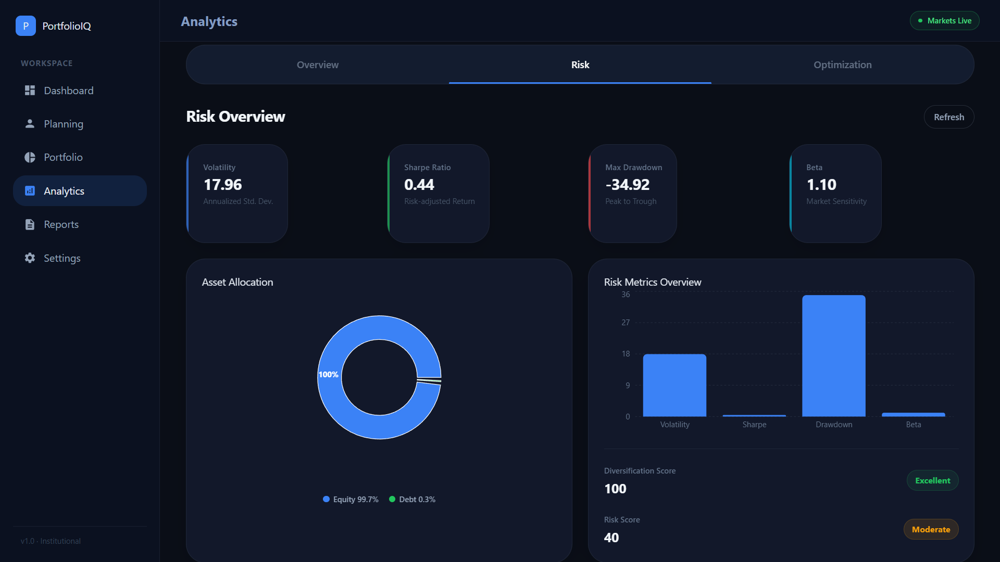
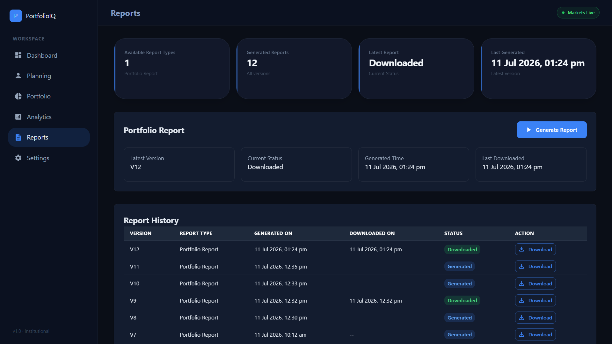

# Portfolio Intelligence Platform


A full-stack **Portfolio Intelligence & Risk Analytics Platform** built with React, FastAPI, and PostgreSQL. It allows investors to build portfolios, track performance, assess risk, optimize asset allocation, run simulations, and generate reports — all through an interactive dashboard.

---

## Table of Contents

- [Live Demo](#live-demo)
- [Features](#features)
- [Tech Stack](#tech-stack)
- [Project Structure](#project-structure)
- [Architecture](#architecture)
- [Screenshots](#screenshots)
- [Getting Started](#getting-started)
- [API Modules](#api-modules)
- [Documentation](#documentation)
- [Roadmap](#roadmap)
- [License](#license)

---

## 🌐 Live Demo

| Resource | Link |
|---|---|
| Frontend | [Open App](https://portfolio-intelligence-platform-tbb.vercel.app) |
| Backend API | [Railway API](https://portfoliointelligenceplatform-production.up.railway.app) |
| API Docs | [Swagger UI](https://portfoliointelligenceplatform-production.up.railway.app/docs) |

---

## 🎥 Demo Video

🚧 **Coming Soon**

A complete walkthrough of the application, including portfolio management, analytics, optimization, risk analysis, and report generation, will be uploaded soon.

*( link will be added here.)*
---

## Features

### Portfolio Management
- User authentication and authorization
- Investor profile and financial goal management
- Portfolio and asset creation (CRUD)
- Live portfolio valuation
- Allocation visualization

### Portfolio Analytics
- Performance tracking and benchmark comparison
- Portfolio health score
- Diversification and correlation analysis
- Factor exposure analysis
- Efficient Frontier visualization
- Monte Carlo simulation
- Goal success probability
- Optimization recommendations

### Risk Analytics
- Volatility, Sharpe Ratio, Beta
- Maximum Drawdown
- Risk score and diversification score
- Asset allocation analysis

### Reporting
- PDF report generation
- Report history and version tracking

---

## Tech Stack

**Frontend:** React · Material UI · Recharts · Axios · Vite

**Backend:** FastAPI · SQLAlchemy · Pydantic

**Database:** PostgreSQL

**Analytics & Finance:** NumPy · Pandas · PyPortfolioOpt · StatsModels · yfinance · ReportLab

---

## Project Structure

```
Portfolio_Intelligence_Platform/
├── backend/
├── frontend/
├── database/
├── docker/
├── docs/
├── tests/
├── README.md
├── LICENSE
└── .env.example
```

---

## Architecture

```
React Frontend
      │
      ▼
FastAPI REST API
      │
      ▼
Business Services
      │
      ▼
SQLAlchemy ORM
      │
      ▼
PostgreSQL
```
For detailed architecture diagrams, ER diagrams, sequence diagrams, and technical documentation, see the `docs/` directory.

---

## Screenshots

### Login Page



---

### Dashboard

#### Overview

.png)

#### Performance

.png)

---

### Planning



---

### Portfolio

#### Portfolio Overview

.png)

#### Portfolio Holdings

.png)

---

### Analytics

#### Overview

.png)

.png)

#### Risk Analytics



#### Portfolio Optimization

.png)

.png)

---

### Reports




---

## Getting Started

### 1. Clone the repository

```bash
git clone https://github.com/Shravan-0/Portfolio_Intelligence_Platform.git
cd Portfolio_Intelligence_Platform
```

### 2. Backend setup

```bash
cd backend
python -m venv venv
venv\Scripts\activate
pip install -r requirements.txt
uvicorn app.main:app --reload
```

### 3. Frontend setup

```bash
cd frontend
npm install
npm run dev
```

---

## API Modules

- Authentication
- Investor Profile
- Portfolio
- Asset Management
- Portfolio Intelligence
- Performance Analytics
- Risk Analytics
- Optimization
- Monte Carlo Simulation
- Efficient Frontier
- Factor Exposure
- Reports

---

## Documentation

Full documentation is available in the [`docs/`](./docs) directory, including:

- Project Overview
- Product Requirements Document (PRD)
- System Architecture
- Database Design
- API Specification
- Backend & Frontend Architecture
- Risk Engine Design
- Monte Carlo Engine
- Efficient Frontier
- Factor Exposure Analysis
- Development Roadmap

---

## Roadmap

- [ ] Live market data streaming
- [ ] Transaction history
- [ ] Automated portfolio rebalancing
- [ ] Multi-benchmark comparison
- [ ] Advanced stress testing
- [ ] Docker deployment
- [ ] CI/CD pipeline

---

## License

This project is licensed under the [MIT License](./LICENSE).